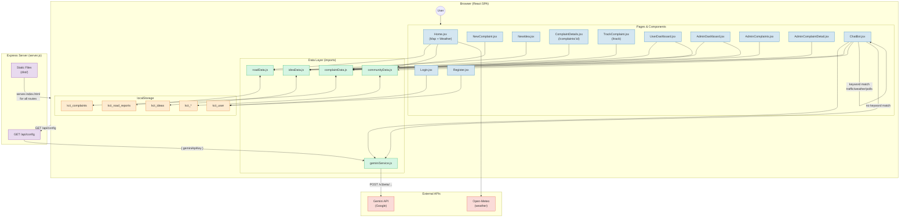

```mermaid
flowchart TB
    subgraph Client["Browser (React SPA)"]
        direction TB
        User((User)) --> Pages

        subgraph Pages["Pages & Components"]
            Home["Home.jsx\n(Map + Weather)"]
            Login["Login.jsx"]
            Register["Register.jsx"]
            NC["NewComplaint.jsx"]
            NI["NewIdea.jsx"]
            CD["ComplaintDetails.jsx\n(/complaints/:id)"]
            TC["TrackComplaint.jsx\n(/track)"]
            UD["UserDashboard.jsx"]
            AD["AdminDashboard.jsx"]
            AC["AdminComplaints.jsx"]
            ACD["AdminComplaintDetail.jsx"]
            CB["ChatBot.jsx"]
        end

        subgraph Data["Data Layer (imports)"]
            CompD["complaintData.js"]
            IdeaD["ideaData.js"]
            RoadD["roadData.js"]
            CommD["communityData.js"]
            Gemini["geminiService.js"]
        end

        subgraph Store["localStorage"]
            LS_Complaints["kct_complaints"]
            LS_Ideas["kct_ideas"]
            LS_Road["kct_road_reports"]
            LS_User["kct_user"]
            LS_Community["kct_*"]
        end
    end

    subgraph Server["Express Server (server.js)"]
        Static["Static Files\n(dist/)"]
        Config["GET /api/config"]
    end

    subgraph External["External APIs"]
        WM["Open-Meteo\n(weather)"]
        GeminiAPI["Gemini API\n(Google)"]
    end

    %% Page → Data imports
    NC --> CompD
    CD --> CompD
    TC --> CompD
    UD --> CompD
    AD --> CompD
    AC --> CompD
    ACD --> CompD

    NI --> IdeaD
    UD --> IdeaD
    AD --> IdeaD

    Home --> RoadD
    Home --> CommD
    Home --> WM

    CB --> Gemini
    CB --> RoadD
    CB --> CommD

    %% Data → localStorage
    CompD <--> LS_Complaints
    IdeaD <--> LS_Ideas
    RoadD <--> LS_Road
    CommD <--> LS_Community

    %% Auth
    Login --> LS_User
    Register --> LS_User

    %% ChatBot flows
    CB -- "keyword match\ntraffic/weather/polls" --> CB
    CB -- "no keyword match" --> Gemini
    Gemini -- "POST /v1beta/..." --> GeminiAPI

    %% Server
    Client -- "GET /api/config" --> Config
    Config -- "{ geminiApiKey }" --> Gemini
    Static -- "serves index.html\nfor all routes" --> Client

    %% Styles
    classDef page fill:#d4e6f1,stroke:#2980b9
    classDef data fill:#d5f5e3,stroke:#27ae60
    classDef store fill:#fdebd0,stroke:#e67e22
    classDef ext fill:#fadbd8,stroke:#e74c3c
    classDef srv fill:#e8daef,stroke:#8e44ad

    class Home,Login,Register,NC,NI,CD,TC,UD,AD,AC,ACD,CB page
    class CompD,IdeaD,RoadD,CommD,Gemini data
    class LS_Complaints,LS_Ideas,LS_Road,LS_User,LS_Community store
    class WM,GeminiAPI ext
    class Static,Config srv
```
